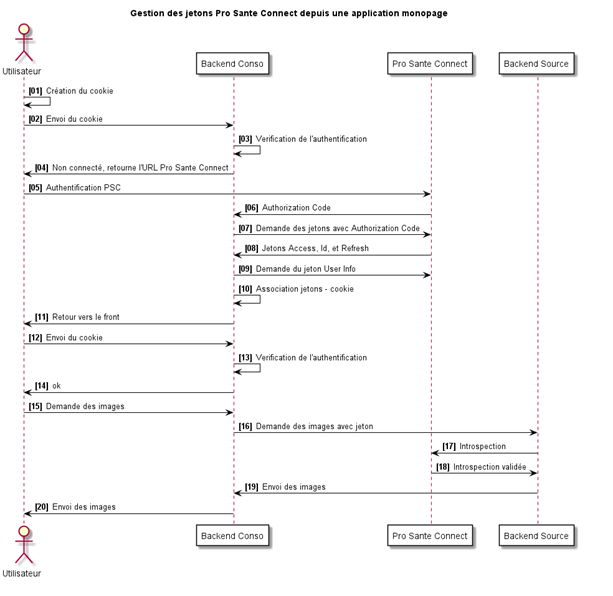
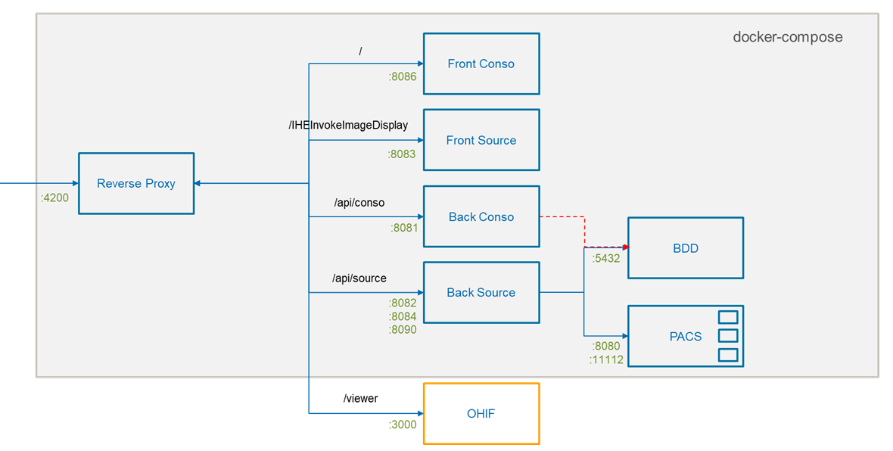

# PoC DRIMbox

Ce code constitue un démonstrateur de la DRIMbox. 
Il ne prend pas en charge l'intégralité des specifications et des exigences. Il s'intéresse principalement à l'interface de consultation des documents disponibles sur le DMP et à l'affichage des images par l'intermédiaire du viewer OHIF. Ce démonstrateur a été testé sur un environnement DMP de test de la CNAM.

Ce démonsrateur est livré tel quel et ne fera pas l'objet de support. 

Certaines modifications pourront être apportées ponctuellement.

Le projet est séparé en plusieurs parties: 
- FrontendRisConso : application Angular en JavaScript et TypeScript pour simuler le RIS/DPI appelant la DRIMbox Conso (depecrated)
- FrontendConso : application Angular en JavaScript et TypeScript pour l'interface de la DRIMbox Conso
- FrontendSource : application Angular en JavaScript et TypeScript pour l'interface de la DRIMbox Source
- Backend : application Quarkus en Java pour le backend de la DRIMbox Conso et Source
- Reverse-proxy : reverse-proxy nginx utilisé lors d'un déploiement complet pour centraliser les requêtes et les répartir vers modules adaptés ensuite.
- TestServer-AppelContextuel : outil Quarkus en Java pour tester l'appel contextuel DRIMbox en provenance des RIS/LPS. 


## Prérequis

Avant de pouvoir lancer l’application, il est d’abord nécessaire de récupérer des cartes CPS de test.
Pour cela, rendez-vous [ici](https://industriels.esante.gouv.fr/produits-et-services/socle-technique-cps#paragraph-id--557%C2%A0), et remplir le formulaire F414


## Authentification vers le DMP

Une fois les cartes CPS récupérées, la DRIMbox nécessite un ensemble de certificats à récupérer [ici](https://pfc.eservices.esante.gouv.fr/pfcng-ihm/authentication.xhtml) pour communiquer avec le DMP. 
Les certificats doivent être placés dans `Backend\src\main\resources\dmp` :

- `auth.p12` le certificat d'authentification
- `signature.p12` le certificat de signature du VIHF

Les certificats doivent être générés avec le type `ORG`. Les certificats associés à un personnel de santé (`PS`) ne marcheront pas.

L'objet du certifcat doit contenir un champ `OU`, qui n'est pas présent dans un certifcat `PS`

- Valide : `CN=DRIMbox, OU=499700367909006, O=CABINET M DOC0036790, ST=Paris (75), C=FR`
- Invalide : `CN=899700367917 + SURNAME=MAXIMAXIMAXIMAXIMAXI0036791 + GIVENNAME=MUMUMUMUMUMUMUMUMUMUMUMUMUM, T=Médecin, C=FR`

Le mot de passe des certificats doit être indiqué dans le fichier `Backend\src\resources\application.properties` :

La propriété `dmp.auth.certif.password` doit être associée au mot de passe utilisé pour les fichiers p12.

> NOTE : 
>
> Un certificat de confiance est nécessaire pour se connecter au DMP. Nous avons utilisé `ACI-EL-ORG.crt` dans ce code d'exemple. La liste des certificats est disponible ici : http://igc-sante.esante.gouv.fr/PC/
> 
> Java ne permet pas d'utiliser les certificats en l'état qui doivent être incorporés dans un keystore (.jks).  Pour générer votre keystore (dans le répertoire `Backend/src/main/resources/dmp/authClient-truststore.jks` ), les instructions sont disponibles sur le header de la classe `DMPKeyStore.java`. 
> Un mot de passe est nécessaire pour l'accès à ce keystore. Il est à renseigner en clair dans le fichier `Backend\src\resources\application.properties`  (propriété `dmp.auth.store.password`)


## Pro Santé Connect (PSC)

Pour activer l’authentification Pro Santé Connect, il est d’abord nécessaire d’enregistrer le service au niveau de [l’espace industriel](https://industriels.esante.gouv.fr/produits-et-services/pro-sante-connect).

Le client ID et le secret doivent être rempli dans `Backend\src\resources\application.properties` : 
- Client ID : `quarkus.oidc.client-id` 
- Secret : `quarkus.oidc.credentials.secret`


Lors de l'enregistrement à Pro Santé Connect, une url de redirection sera demandée, par exemple `http://localhost:4200/*` 

Cette URL est à renseigner dans `Backend\src\resources\application.properties` au niveau des propriétés `conso.host` et `source.host`

Le front-end génère un cookie de session appelé `SessionToken` permettant de s'identifier sur le backend. Le backend fait les appels à Pro Santé Connect et renvoie l'état de la connection au front-end.

Si les tokens associés aux cookies ne sont plus valides (expiration par exemple), le backend renverra sur la page Pro Santé Connect afin de se réidentifier.




## Compilation & lancement

### Front-end RIS Conso

Prérequis :
- [Node.js](https://nodejs.org/en/) (version 16.xx LTS)
- [Yarn](https://yarnpkg.com/getting-started/install)

Puis, dans le répertoire **frontendRisConso** faire :

```bash
yarn install
yarn start
```

### Front-end Conso

Prérequis :
- [Node.js](https://nodejs.org/en/) (version 16.xx LTS)
- [Yarn](https://yarnpkg.com/getting-started/install)

Puis, dans le répertoire **frontendConso** faire :

```bash
yarn install
yarn start
```

### Front-end Source

Prérequis :
- [Node.js](https://nodejs.org/en/) (version 16.xx LTS)
- [Yarn](https://yarnpkg.com/getting-started/install)

Puis, dans le répertoire **frontendSource** faire :

```bash
yarn install
yarn start
```

### Backend

Prérequis :

- [Quarkus](https://quarkus.io/get-started/) (si Java n'est pas installé, Quarkus se chargera de l'installer pour vous)
- [Maven](https://maven.apache.org/install.html)
- Le service ou conteneur Posgres doit être démarré

Puis dans le répertoire **backend** faire :

```bash
./mvnw compile quarkus:dev -Dquarkus.args=source
```
ou
```bash
./mvnw compile quarkus:dev -Dquarkus.args=conso
```
L'argument passé avec `-Dquarkus.args` permet de définir au lancement s'il s'agit d'une DRIMbox Conso ou Source.

Une fois démarré, le serveur est disponible sur le port 8081 par défaut.


Pour relancer la DRIMbox si erreur
```bash
./mwn clean
```

### Base de données POSTRESQL

La base de données permet de sauvegarder les KOS publiés sur le DMP.

Pour démarrer la base de données en mode natif: 

```bash
sudo apt install postgresql postgresql-contrib
sudo service postgresql start
sudo -u postgres psql
ALTER USER postgres WITH PASSWORD 'pswd';
```
Sinon, il est également possible de démarrer la base de données depuis le docker-compose principal sous  `/docker`:

```bash
cd docker
docker-compose build postgres
docker-compose up postgres
```

Si vous apportez des modifications à la BDD, il est important de remplir les propriétés `quarkus.datasource` présent dans le fichier `Backend\src\resources\application.properties` afin que la DRIMbox arrive à communiquer avec la BDD.


### Déploiement local complet sous docker

Pour fonctionner, la DRIMbox nécessite de configurer les intéractions entre ces différents composants.
De manière à faciliter cette intégration et un déploiement local complet, un fichier docker-compose est proposé sous `/docker`. 

La partie visionneuse n'a cependant pas été intégrée dans ce docker-compose. 
Il est donc nécessaire de : 
-  Récupérer le code d'OHIF sur le [Git ANS](https://github.com/ansforge/DRIM-M_OHIF) et la branche [metadata-loading-rebased]()
- Modifier le fichier `platfom/app/.env` pour changer le paramètre:
  `PUBLIC_URL=/viewer/`
- Puis lancer les commandes (plutôt sous powershell, très long sous ubuntu)
```bash
yarn install
yarn start
```

Ensuite modifier la configuration du reverse-proxy de la DRIMbox (`./reverse-proxy`) pour indiquer l’IP du service OHIF	
```bash
location /viewer {
    resolver   127.0.0.11;
    proxy_pass http://IPduServiceOHIF:3000/viewer;
```

Puis lancer le docker-compose (sous `./docker`):
```bash
cd docker
docker-compose build
docker-compose up
```

Le front Conso est normalement disponible à l'adresse http://localhost:4200/

Le schéma ci dessous détaille les intéractions entre les différents modules.
Un PACS dcm4chee est également intégré directement dans le docker-compose




### Déploiement en production

Pour un déploiement en production, il est nécessaire d'intégrer la gestion des certificats SSL et les certificat IGC-Santé
  - Au niveau du reverse-proxy
  - Ou au niveau des backends de manière à pouvoir gérer les TLSm.
  
En fonction des choix de déploiements, certaines routes peuvent être amenées à être modifiée dans l’application ou au niveau du reverse-proxy.

Ensuite: 
- Mettre à jour les certificats DMP si besoin
- Modifier l’URL de redirection auprès des services PSC
- et enfin de modifier les variables:
  - conso.host
  - source.host
  - et les mdp des certificats et de la bdd si besoin


## Notes d'implementation

### DRIMbox Conso vs DRIMbox Source

Le backend contient à la fois le code de la DRIMbox Conso et de la DRIMbox Source. 

Pour la récupération des images, la DRIMbox Conso peut interroger la DRIMbox Source, qui est reliée au PACS Source. La DRIMbox Conso et la DRIMbox Source possèdent un système de cache pour éviter de faire des requêtes inutiles.


### Cache des images dicom

Pour éviter de faire trop de requêtes, un système de cache a été mis en place au niveau de la DRIMbox.

Le cache utilise les types `Uni` de `mutiny` pour ne pas bloquer les requêtes ainsi que des `Future`. 


Une requête WADO-RS au niveau Série est faite à la DRIMbox Source, qui renvoie toutes les images associées à la DRIMbox Conso. OHIF demande ensuite toutes les images, instance par instance, à la DRIMbox Conso, qui va répondre avec les images du cache.

Tout se fait de façon asyncrhone afin de pas bloquer le reste du backend.


### Configuration du PACS dans la DRIMbox Source

Le docker-compose principal permet de démarrer un PACS, permettant de jouer le rôle de PACS Source.

Plusieurs configurations sont nécessaires dans le fichier `Backend\src\resources\application.properties` afin de réaliser la connexion entre la DRIMbox et le PACS.

- dcm.cstore.host  et dcm.cstore.port : adresse IP et port sur laquelle la DRIMbox Source va écouter. 
- dcm.cstore.AET correspond à l'AETITLE du CStoreSCP de la DRIMbox Source et configuré dans le PACS Source avec l'IP de `dcm.cstore.host` et le port de `dcm.cstore.port`.
- dcm.cmove.calledAET correspond à l'AETITLE de votre PACS Source.
- dcm.cmove.port correspond au port de votre PACS Source.
- dcm.cmove.callingAET correspond à l'AETITLE du CMoveSCU de la DRIMbox Source et configuré dans le PACS Source avec l'IP de `dcm.cstore.host` et le port `104`.

Vous devrez également créer un AET dans le PACS. Pour dcm4chee, il vous faudra créer un AETitle avec le nom contenu dans `dcm.cstore.AET` avec l'ip de la machine sur laquelle la DRIMbox source écoute. Notez qu'il faudra renseigner l'IP de la DRIMbox Source et que le `127.0.0.1` ou `localhost` ne marcheront pas.


### Configuration du Pacs dans la DRIMbox Conso

Aujourd'hui, l'export vers le Pacs de la DRIMbox Conso se fait via un lien DICOMWeb.
Ce lien est paramétrable avec la propriété `pacs.stowUrl` au niveau du fichier `Backend\src\resources\application.properties`.


## Erreurs courantes

### "No route to host" pendant le C-MOVE

Le message suivant peut apparaître lors du C-MOVE (DRIMbox source) :

```
 LOCAL->DCM4CHEE(3) >> 1:C-MOVE-RSP[pcid=1, status=a702H, errorComment=java.net.NoRouteToHostException: No route to host (Host unreacha
  tsuid=1.2.840.10008.1.2 - Implicit VR Little Endian]
```

Ce message est du à une mauvaise configuration du PACS et de l'aelist. Voir la section configuration de la DRIMbox source et assurez vous que l'AET et le port soit bien renseignés dans le pacs.

## Contact

Pour toute information complémentaire, merci de contacter ans-forge@esante.gouv.fr

